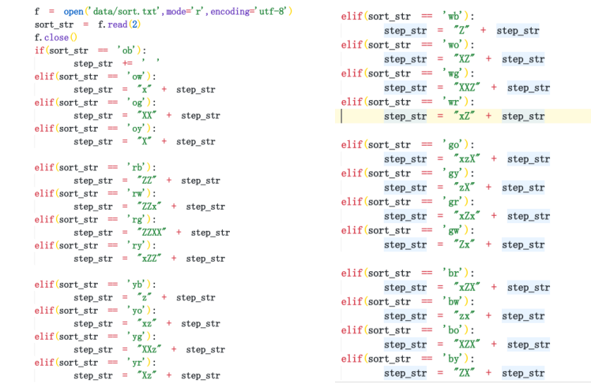

# 双臂魔方机器人

- [双臂魔方机器人](#双臂魔方机器人)
  - [设备总体设计方案](#设备总体设计方案)
    - [整体流程](#整体流程)
  - [硬件设计](#硬件设计)
    - [机械结构](#机械结构)
  - [软件设计](#软件设计)
    - [运动控制算法设计](#运动控制算法设计)
    - [图像处理设计](#图像处理设计)
    - [魔方算法设计](#魔方算法设计)
    - [GUI界面设计](#gui界面设计)

## 设备总体设计方案

### 整体流程

整体流程为:本作品以Arduino UNO单片机为控制核心，树莓派为图形处理核心。用DM542C数字驱动器驱动42步进电机实现机器手臂的“手腕”转动，单片机发送PWM信号能够控制20kg大扭矩数字伺服电机，以实现机器人手臂的“手指”收合。我们使用树莓派外接7寸显示屏和自主设计的GUI界面作为显示和操作终端，通过摄像头识别魔方颜色，通过树莓派对结果进行处理，用串口发送机器手臂的可执行信号给Arduino UNO，再通过Arduino控制机械手臂，完成魔方的复原。

## 硬件设计

### 机械结构

本作品的总体机械结构呈现直立双臂魔方机器人，包括机械手臂和摄像头支架等。魔方采用斜放放置，摄像头俯视整个魔方，确保加快魔方的颜色识别。机械臂转动驱动使用步进电机，机械爪使用平行爪，确保平稳的抓取魔方，总体三维建模使用solidworks软件，三维模型文件在 model 目录下。

## 软件设计

### 运动控制算法设计

运动控制采用Arduino UNO单片机实现，使用串口连接树莓派，等待树莓派对魔方状态进行程序分析，得到魔方还原序列发送给Arduino UNO单片机。Arduino UNO单片机再将数据进行处理，控制电机实现魔方的复原。

步进电机属于开环系统，容易出现丢步和抖动等现象，硬件上对输入电流的控制和驱动器细分选择外，软件上还可以通过缓慢启停步进电机实现，通过改变给步进电机驱动器的脉冲快慢可以实现，具体实现代码如下

除此之外，步进电机如果一直往一个方向转动，会使舵机的信号线和机器手臂缠绕。为了避免这种情况发生，我们为每一个机器手臂设置一个标志变量，每次执行180度转动时，反转标志位，使下一次180度转动为相反反向。具体实现代码如下。

具体控制代码见[代码](code/arduino/cube12_01.ino)

### 图像处理设计

本作品中图像处理的整体思路：使用树莓派控制摄像头进行拍摄，把魔方的初始状态拍成图片，处理图片并将魔方每一面的颜色和魔方的位置存储到文本中；再对存储的文本内容进行分析，采用二阶段算法得到还原魔方的解法，再将六面转动解法通过优化生成二指还原解法，发送给Arduino UNO单片机对魔方进行复原。

图像处理程序均用python编程语言和opencv图像处理库实现。树莓派发送转动指令给Arduino单片机，转动三次，一次拍摄两面，将魔方初始状态通过照片存储起来。先对图片进行简单的高斯模糊去噪处理，再分割成单面图像。因为魔方位置是固定的，这里只需要对图片的特定位置进行分割，再通过文本矫正将不规则的梯形转成矩形，分割前后的图片和分割部分的关键程序代码分别如下图。

颜色识别采用将图片色彩空间从传统的RGB转换成HSV和LAB，HSV即色相(Hue)、饱和度(Saturation)、明度(Value)，又称HSB(B即Brightness)。H色相是色彩的基本属性，HSV色彩空间对颜色判断灵敏，且颜色识别时不易受明亮度的影响；Lab颜色被设计来接近人类视觉。它致力于感知均匀性，它的L分量密切匹配人类亮度感知。因此可以被用来通过修改a和b分量的输出色阶来做精确的颜色平衡，或使用L分量来调整亮度对比。

两种色彩空间都可以有效的减少因为环境光增加识别魔方的难度，这里采用双色彩空间进行矫正，RGB和LAB色彩空间、HSV色彩空间的对比图如下。

在图片分割矫正和色彩空间转换后，就要将魔方每一个面的九个色块的LAB和HSV色彩空间的值都存储起来，以便后续进行颜色识别分类，相应代码如下图。

具体图像处理代码见[代码](code/raspberry-pi/cube.py)

最后的就是程序最为重要的颜色识别分类，我采用的是多次循环HSV和LAB双色彩空间矫正的K-means聚类算法，对不同的光照的环境都能很好的识别。HSV和LAB色彩空间识别生成的三维图分别如下图。

具体聚类代码见[代码](code/raspberry-pi/kmeans.py)

### 魔方算法设计

解魔方比赛中，主流的魔方解法，无论是从入门的层先，到进阶的CFOP、桥式，都是从部分到整体的思路，逐块还原魔方。这种方法之所以能在速拧比赛中广泛应用，依赖于人眼与人脑快速反应的结合，但这种解法并不适合与计算机。

机器的优势在于广度搜索与深度搜索能力，解魔方算法采用二阶段算法，也称为Kociemba算法，通过降低魔方的混乱程度，达到复原的效果。这种魔方解法的步数可以控制在21步以内，通过转换为二指解法也不过需要四十到七十步左右，二阶段算法还原魔方的示意图如图

仅仅通过前面采集到的魔方每一面的颜色序列，还不能直接使用二阶段算法，需要提前设置每一面的相对位置，例如设定为白上绿前，但这是不现实的，不能得知乱魔方放置的初始位置，通过归类，可以得到一共由8种不同的相对位置。判断识别面中心的顺序，可以旋转面的颜色序列，达到实现白上绿前的相对位置。

在调整旋转对应面的模仿序列后，还需要添加实际魔方序列和设定魔方序列 ”白上绿前”的相互关系，即将任意序列转到设定序列的转动步骤，则读取识别面的顺序文件，得到识别的前两面，即得到实际坐标。

就可以使用二阶段算法了。使用二阶段算法，针对任意一个乱魔方都可以得到一串只有不到21步的还原公式。本作品设计的是一款双臂的魔方机器人，无法同时对六个面进行转动；通过对另外只能间接控制的面转换成两个可以同时控制的面的公式，即可实现通过双臂机器人还原魔方。转换后，得到的还原公式还比较繁琐，需要进一步优化，例如顺时针旋转一面三圈相当于逆时针旋转一圈。转换过程如图所示。

具体魔方算法代码见[代码](code/raspberry-pi/solution.py)

### GUI界面设计

本作品使用一块树莓派外接7寸显示屏，可触控。决定设计一个GUI交互界面，方便显示魔方的实况和解法等信息，以及可以实现一键解魔方的功能。

GUI界面主要由四部分组成，左上部分为摄像头的实时图像，可以方便显示魔方的实况；右上部分为识别到的魔方序列图解，可以全面的显示识别结果以及魔方整体的初始状态；左下部分为文本框，显示魔方的解法等信息；右下角有两个用户按键，一个可以发送转动信号，得到魔方的初始状态，另一个则是一键运行解魔方程序，具体界面如图5-3-1所示。

具体GUI界面代码见[代码](code/raspberry-pi/gui.py)

